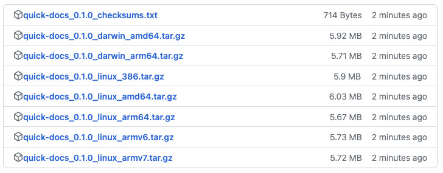
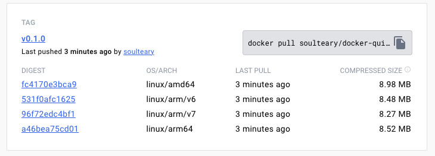

# Docker Quick Docs

[](https://github.com/soulteary/docker-quick-docs/actions/workflows/release.yaml) [](https://github.com/soulteary/docker-quick-docs/actions/workflows/codecov.yml) [](https://github.com/soulteary/docker-quick-docs/actions/workflows/codeql.yml) [](https://goreportcard.com/report/github.com/soulteary/docker-quick-docs)

本地部署、能够快速访问的文档工具，用来改善 GitHub Pages 文档访问体验。

## 下载工具

在 GitHub [发布页面](https://github.com/soulteary/docker-quick-docs/releases) 下载适合你操作系统的可执行文件。



或者使用 Docker 下载工具：



```bash
docker pull soulteary/docker-quick-docs:v0.1.2
# 或者
docker pull soulteary/docker-quick-docs
```

## 使用工具

以 [baidu/san](http://github.com/baidu/san) 为例，我们将这个软件的 GitHub 进行本地化部署。

首先，获取想本地部署的软件的文档代码，GitHub Pages，通常需要下载 GitHub 的 `gh-pages` 分支：

```bash
git clone http://github.com/baidu/san --depth 1 --branch=gh-pages
Cloning into 'san'...
warning: redirecting to https://github.com/baidu/san/
remote: Enumerating objects: 405, done.
remote: Counting objects: 100% (405/405), done.
remote: Compressing objects: 100% (197/197), done.
remote: Total 405 (delta 154), reused 303 (delta 65), pack-reused 0
Receiving objects: 100% (405/405), 2.17 MiB | 5.18 MiB/s, done.
Resolving deltas: 100% (154/154), done.
```

然后，我们可以将这些文档放到 `docs` 目录中。

```bash
mv san docs/
```

然后我们执行程序即可：

```bash
# 如果你选择使用可执行文件
./quick-docs

# 如果你选择使用 docker
docker run --rm -it -v `pwd`/docs:/app/docs -p 8080:8080 soulteary/docker-quick-docs:v0.1.2
```

程序执行完毕，我们将看到类似下面的日志：

```bash
2024/01/04 10:38:31 Quick Docs
2024/01/04 10:38:31 未设置环境变量 `PORT`，使用默认端口：8080
```

此时访问浏览器，就能够快速的访问文档啦。

## 配置

如果你想调整端口，可以设置 `PORT` 环境变量。

例如：

```bash
PORT=8080 ./quick-docs
# 或
docker run --rm -it -e PORT=8080 -v `pwd`/docs:/app/docs -p 8080:8080 soulteary/docker-quick-docs:v0.1.2
```
