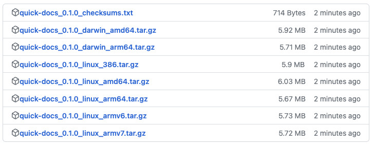
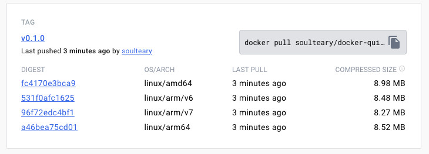

# Docker Quick Docs

[](https://github.com/soulteary/docker-quick-docs/actions/workflows/release.yaml) [](https://github.com/soulteary/docker-quick-docs/actions/workflows/codecov.yml) [](https://github.com/soulteary/docker-quick-docs/actions/workflows/codeql.yml) [](https://goreportcard.com/report/github.com/soulteary/docker-quick-docs)

本地部署、能够快速访问的文档工具，用来改善 GitHub Pages 文档访问体验。The project offers a lightweight way to host documentation locally and browse it at high speed without depending on GitHub Pages.

## Overview | 项目简介

- **EN**: Docker Quick Docs serves static documentation bundles from your local machine, removing latency introduced by public hosting and giving you full control of the browsing experience.
- **ZH**: Docker Quick Docs 可以在本地机器中快速部署静态文档，绕过公网访问的延迟，让你完全掌控浏览体验。

## Download | 获取方式

- **EN**: Download the executable that matches your operating system (Linux, macOS, or Windows) from the GitHub [Releases page](https://github.com/soulteary/docker-quick-docs/releases).
- **ZH**: 前往 GitHub [发布页面](https://github.com/soulteary/docker-quick-docs/releases) 下载与你操作系统匹配的可执行文件（支持 Linux、macOS、Windows）。



- **EN**: Prefer Docker? Pull the ready-to-run image from Docker Hub.
- **ZH**: 如果习惯使用 Docker，可以直接从 Docker Hub 拉取镜像。



```bash
docker pull soulteary/docker-quick-docs:v0.1.8
# EN: or pull the latest tag automatically
# ZH: 或者直接拉取最新的镜像标签
docker pull soulteary/docker-quick-docs
```

## Usage | 使用示例

- **EN**: The following walkthrough localizes the documentation of [baidu/san](http://github.com/baidu/san) by cloning its GitHub Pages branch.
- **ZH**: 下面演示如何克隆 [baidu/san](http://github.com/baidu/san) 的 GitHub Pages 分支，将文档本地化部署。

```bash
git clone http://github.com/baidu/san --depth 1 --branch=gh-pages
Cloning into 'san'...
warning: redirecting to https://github.com/baidu/san/
remote: Enumerating objects: 405, done.
remote: Counting objects: 100% (405/405), done.
remote: Compressing objects: 100% (197/197), done.
remote: Total 405 (delta 154), reused 303 (delta 65), pack-reused 0
Receiving objects: 100% (405/405), 2.17 MiB | 5.18 MiB/s, done.
Resolving deltas: 100% (154/154), done.
```

- **EN**: Move the cloned site into the `docs` directory so the server can pick it up.
- **ZH**: 将克隆好的站点移动到 `docs` 目录中，便于程序读取。

```bash
mv san docs/
```

- **EN**: Start the server with either the native binary or the Docker container.
- **ZH**: 使用原生二进制或 Docker 容器启动服务。

```bash
# EN: native binary
# ZH: 原生二进制
./quick-docs

# EN: Docker container (multi-doc directory browsing, default)
# ZH: Docker 容器（多文档目录浏览，默认模式）
docker run --rm -it \
  -v $(pwd)/docs:/app/docs \
  -v $(pwd)/config.json:/app/config.json \
  -p 8080:8080 \
  soulteary/docker-quick-docs:v0.1.8

# EN: Docker container (single site, auto-serve index.html)
# ZH: Docker 容器（单站点，自动打开 index.html）
docker run --rm -it \
  -e INDEX=on \
  -v $(pwd)/docs:/app/docs \
  -v $(pwd)/config.json:/app/config.json \
  -p 8080:8080 \
  soulteary/docker-quick-docs:v0.1.8
```

- **EN**: When the application starts you should see logs similar to the following.
- **ZH**: 程序启动后，会出现类似如下的日志输出。

```bash
2024/01/04 10:38:31 Quick Docs
2024/01/04 10:38:31 未设置环境变量 `PORT`，使用默认端口：8080
2024/01/04 10:38:31 解析配置文件成功，规则数量: 5
2024/01/04 10:38:31 监听 http://0.0.0.0:8080
```

- **EN**: Open your browser at `http://localhost:8080` to browse the imported documentation immediately.
- **ZH**: 打开浏览器访问 `http://localhost:8080`，即可快速浏览刚导入的文档。

## Configuration | 配置

### Environment variables | 环境变量

| Variable | Default | Description |
|----------|---------|-------------|
| `PORT` | `8080` | Listening port / 监听端口 |
| `HOST` | `0.0.0.0` | Bind address / 监听地址 |
| `DOCS` | `docs` | Document root directory / 文档根目录 |
| `CONFIG` | `./config.json` | Path to replacement rules file / 替换规则配置文件路径 |
| `EMBED` | off | Set to `on` to serve embedded docs from the binary / 设为 `on` 时使用二进制内嵌的 `docs` 目录 |
| `INDEX` | off | Set to `on` to auto-serve `index.html` / 设为 `on` 时访问目录自动打开 `index.html` |

- **EN**: Customize the listening port by defining the `PORT` environment variable before starting the program.
- **ZH**: 如果需要修改监听端口，在启动程序前设置 `PORT` 环境变量即可。

```bash
PORT=8080 ./quick-docs
# EN: or with Docker
# ZH: 或者使用 Docker
docker run --rm -it -e PORT=8080 \
  -v $(pwd)/docs:/app/docs \
  -v $(pwd)/config.json:/app/config.json \
  -p 8080:8080 \
  soulteary/docker-quick-docs:v0.1.8
```

### Static file serving | 静态文件服务

- **EN**: By default (`INDEX=off`), the root path `/` shows a **directory listing** and does not auto-open `index.html`. This suits hosting multiple documentation bundles under one `docs` folder. Set `INDEX=on` when serving a single site and you want `/path/` to open `index.html` automatically.
- **ZH**: 默认（`INDEX=off`）下，根路径 `/` 为**目录浏览**模式，不会自动打开 `index.html`，适合在同一 `docs` 目录下聚合多份文档。若只部署单个站点并希望访问 `/path/` 时自动打开首页，请设置 `INDEX=on`。

- **EN**: A health check endpoint is available at `GET /health` (returns 200).
- **ZH**: 健康检查端点：`GET /health`（返回 200）。

### URL replacement rules | URL 替换规则

- **EN**: Place a `config.json` file next to the binary (or mount it in Docker at `/app/config.json`). The file must be a JSON **array** of rules. Each rule replaces matching strings in response bodies so offline docs can resolve links to local paths. A single JSON object is also accepted and will be wrapped automatically.
- **ZH**: 在可执行文件旁放置 `config.json`（Docker 中挂载到 `/app/config.json`）。文件必须是 JSON **数组**；若误写为单个对象，程序会自动包装。每条规则会在响应 body 中替换匹配的字符串，使离线文档中的外链指向本地路径。

Example rule / 规则示例（from [`config.json`](config.json)）:

```json
{
  "from": "https://ecomfe.github.io/san/",
  "to": "/san/",
  "type": "html",
  "dir": "/san/"
}
```

| Field | Default | Description |
|-------|---------|-------------|
| `from` | required | String to find in the response body / 响应 body 中要替换的字符串 |
| `to` | required | Replacement value / 替换目标 |
| `type` | `html` | Response MIME type to match (`html`, `css`, `js`, `json`, or full MIME) / 匹配的响应 MIME 类型 |
| `dir` | `*` | Apply only to paths with this prefix / 仅对该路径前缀下的响应生效 |

- **EN**: The `type` field refers to the **response Content-Type**, not the URL being replaced. To rewrite URLs inside CSS or JS file bodies, set `"type": "css"` or `"type": "js"` explicitly.
- **ZH**: `type` 指**响应的 MIME 类型**，不是被替换 URL 的类型。若要替换 CSS/JS 文件内容中的 URL，需显式设置 `"type": "css"` 或 `"js"`。

- **EN**: HTML responses always have common analytics scripts (Google Analytics, Baidu Tongji, Matomo, CNZZ, etc.) replaced with a local stub, even without a config file.
- **ZH**: 即使未提供配置文件，HTML 响应中的常见统计脚本（Google Analytics、百度统计、Matomo、CNZZ 等）也会被替换为本地占位脚本。
